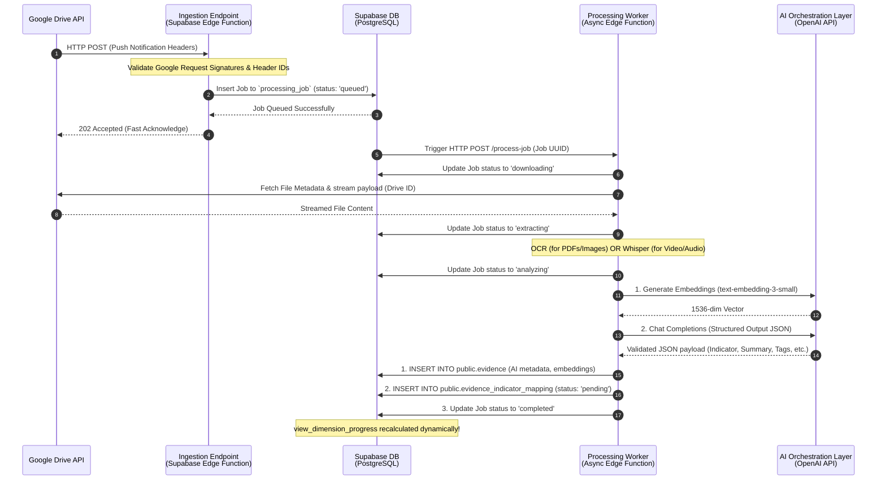
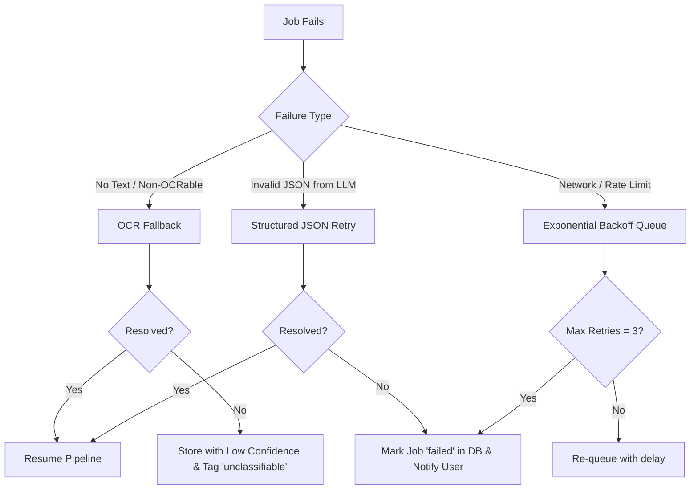

# KruPortfolio AI (Teacher Portfolio OS)
## Backend & AI Ingestion Architecture Design

This document details the backend architecture, event-driven processing workflow, API contracts, LLM prompt engineering, and resiliency mechanics for the KruPortfolio AI ingestion layer.

---

## 1. System Sequence Diagram & Processing Workflow

The system uses an asynchronous, queue-based, event-driven architecture to handle Google Drive webhooks. This prevents HTTP request timeouts (since Google Drive webhooks must be acknowledged within a few seconds) and isolates heavy file operations.



### Detailed Workflow Step-by-Step

1.  **Google Drive Notification:** Google Drive triggers our endpoint when a change occurs in the teacher's synced directory.
2.  **Fast Acknowledge:** The webhook handler quickly logs the change details into our `processing_job` tracking table and returns an HTTP `202 Accepted` status within 500ms to avoid webhook retries.
3.  **Asynchronous Activation:** A Supabase Database Webhook detects the insert on `processing_job` and triggers the worker function via an HTTP call (using the `pg_net` extension for non-blocking HTTP requests).
4.  **File Streaming & Downscaling:** The worker uses the Google Drive API to download the file directly into memory or temporary storage buffers.
5.  **Multi-Modal Extract:** 
    *   **Text/Image PDFs**: Text-based extraction is performed. Scanned images are passed through a lightweight OCR processor (or via GPT-4o multimodal inputs).
    *   **Videos/Audio**: Media is channeled to a transcoding pipeline where audio is extracted and sent to the Whisper API.
6.  **AI Classification**: The text is sent to the AI Orchestration layer to generate a semantic embedding vector and classify the evidence.
7.  **Transaction Mutation**: The evidence metadata and relationships are stored in the database. The job is marked as `completed`.

---

## 2. API Endpoint Contract Spec

### Webhook Ingestion Endpoint: `POST /api/drive-webhook`
Google Drive push notifications send details via headers instead of the request body.

#### Request Headers (Google Push standard)
```http
X-Goog-Channel-ID: channel-uuid-12345
X-Goog-Resource-ID: resource-id-67890
X-Goog-Resource-URI: https://www.googleapis.com/drive/v3/files/file-id-abcde
X-Goog-Resource-State: update
X-Goog-Changed: content,metadata
```

#### Response (Fast Acknowledge)
*   **Status Code:** `202 Accepted`
*   **Payload (JSON):**
```json
{
  "success": true,
  "message": "Notification received, processing job created.",
  "job_id": "893c5d80-5a3d-4290-a35c-76dbe6dbd5bc"
}
```

---

### Job Queue Schema (`public.processing_job`)
To manage asynchronous execution states:

```sql
CREATE TYPE job_status AS ENUM ('queued', 'downloading', 'extracting', 'analyzing', 'completed', 'failed');

CREATE TABLE public.processing_job (
    id UUID PRIMARY KEY DEFAULT gen_random_uuid(),
    user_id UUID NOT NULL REFERENCES public.teacher_profile(id) ON DELETE CASCADE,
    file_id VARCHAR(255) NOT NULL,
    resource_uri TEXT NOT NULL,
    status job_status NOT NULL DEFAULT 'queued',
    retry_count INTEGER NOT NULL DEFAULT 0,
    error_log TEXT,
    created_at TIMESTAMPTZ NOT NULL DEFAULT NOW(),
    updated_at TIMESTAMPTZ NOT NULL DEFAULT NOW()
);
```

---

## 3. Core AI System Prompt Blueprint

To guarantee deterministic outputs and prevent JSON structural failures, we leverage OpenAI's **Structured Outputs** framework (API parameter: `response_format: { type: "json_schema", json_schema: ... }`).

### System Prompt Blueprint

```text
You are the AI Evaluation Ingestion Engine for KruPortfolio AI, a specialized platform for Thai Teacher Evaluations under the วPA (ว1st) framework.
Your task is to analyze raw extracted text or OCR data from a teacher's evidence file and classify it into the most appropriate evaluation indicator.

Thai Teacher Evaluation Framework Reference (วPA Indicators):
- D1: ด้านทักษะการจัดการเรียนรู้และการจัดการชั้นเรียน (Learning & Classroom Management)
  - I1.1: การสร้างและหรือพัฒนาหลักสูตร (Curriculum Development)
  - I1.2: การออกแบบการจัดการเรียนรู้ (Learning Design / Lesson Planning)
  - I1.3: การจัดกิจกรรมการเรียนรู้ (Learning Activity Facilitation)
  - I1.4: การเลือกและหรือพัฒนาสื่อ นวัตกรรม เทคโนโลยี และแหล่งเรียนรู้ (Learning Media & tech)
  - I1.5: การวัดและประเมินผลการเรียนรู้ (Assessment & Evaluation)
  - I1.6: การศึกษา วิเคราะห์ และสังเคราะห์ เพื่อแก้ไขปัญหาหรือพัฒนาการเรียนรู้ (Action Research)
  - I1.7: การจัดบรรยากาศที่ส่งเสริมและพัฒนาผู้เรียน (Classroom Atmosphere)
  - I1.8: การอบรมและพัฒนาคุณลักษณะที่ดีของผู้เรียน (Student Character Development)
- D2: ด้านการส่งเสริมและสนับสนุนการจัดการเรียนรู้ (Support of Learning)
  - I2.1: การจัดทำข้อมูลสารสนเทศของผู้เรียนและรายวิชา (Student & Class Information Systems)
  - I2.1: การดำเนินการตามระบบดูแลช่วยเหลือผู้เรียน (Student Support Systems / Guidance)
  - I2.3: การปฏิบัติงานวิชาการ และงานอื่นๆ ของสถานศึกษา (Academic & School Administration)
  - I2.4: การประสานความร่วมมือกับผู้ปกครอง ภาคีเครือข่าย และหรือสถานประกอบการ (Parent & Community Collaboration)
- D3: ด้านการพัฒนาตนเองและวิชาชีพ (Professional Development)
  - I3.1: การพัฒนาตนเองอย่างเป็นระบบและต่อเนื่อง (Personal Growth / Professional Training)
  - I3.2: การมีส่วนร่วม และเป็นผู้นำในการแลกเปลี่ยนเรียนรู้ทางวิชาชีพ (PLC Participation & leadership)
  - I3.3: การนำความรู้ ความสามารถ ทักษะที่ได้จากการพัฒนาตนเองและวิชาชีพมาใช้ (Applying Professional Knowledge)
- CH: ส่วนที่ 2: ข้อตกลงประเด็นท้าทาย (Performance Agreement Challenge)
  - ICH1.1: ข้อตกลงประเด็นท้าทายในการพัฒนาผลลัพธ์การเรียนรู้ของผู้เรียน (Challenge Project)

Instructions:
1. Thoroughly read the provided document extract.
2. Identify which วPA indicator best matches the primary context of the file.
3. Write a concise document summary in professional Thai language.
4. Auto-generate relevant tags in Thai and English describing the evidence content.
5. Provide a step-by-step reasoning justification in Thai explaining why this file fits the selected indicator.
6. Assess your classification confidence score (0.00 to 1.00).

Strict Rules:
- Do not hallucinate or default to random codes. If the text does not contain enough context, set a low confidence score.
- Output MUST conform strictly to the required JSON schema.
```

### JSON Schema Enforcer (OpenAI API Param Contract)

```json
{
  "name": "evidence_classification",
  "strict": true,
  "schema": {
    "type": "object",
    "properties": {
      "suggested_indicator_code": {
        "type": "string",
        "description": "The target indicator code that matches this evidence.",
        "enum": [
          "I1.1", "I1.2", "I1.3", "I1.4", "I1.5", "I1.6", "I1.7", "I1.8",
          "I2.1", "I2.2", "I2.3", "I2.4",
          "I3.1", "I3.2", "I3.3",
          "ICH1.1"
        ]
      },
      "ocr_summary": {
        "type": "string",
        "description": "A concise summary of the document's content and relevance to the indicator, in Thai."
      },
      "ai_tags": {
        "type": "array",
        "items": { "type": "string" },
        "description": "Keywords describing the content, subject, grade level, and document type in Thai."
      },
      "confidence_score": {
        "type": "number",
        "description": "AI confidence level in classification accuracy between 0.00 and 1.00."
      },
      "reasoning_justification": {
        "type": "string",
        "description": "Step-by-step explanation of the classification decision in Thai."
      }
    },
    "required": [
      "suggested_indicator_code",
      "ocr_summary",
      "ai_tags",
      "confidence_score",
      "reasoning_justification"
    ],
    "additionalProperties": false
  }
}
```

---

## 4. Heavy Asset Handling & Token Optimization

### Token Optimization for Large Documents (PDFs > 100 pages)
Sending a 100-page document (~50,000+ words) to an LLM wastes tokens on repetitive text structures and can exceed context limits.
*   **Boilerplate Stripping:** Remove HTML tags, redundant formatting, page numbers, and repeating headers/footers.
*   **Adaptive Structural Extraction (Layout Filtering):** For วPA portfolios, classification data is highly concentrated. The worker extracts:
    *   Pages 1-5 (Title, Table of Contents, Introduction)
    *   Pages with tables, headers containing keyword matches (e.g. "จุดประสงค์", "ตัวชี้วัด", "สรุปผล")
    *   Last 5 pages (Conclusion, Signatures, Bibliography)
*   **Recursive Summarization (MapReduce):** If full document context is required, summarize chunks of 10 pages, then feed the summarized chain to the classifier.

### Processing Large Classroom Videos (100MB to 2GB+)
*   **Audio Demuxing:** The serverless worker does not download the entire video. We stream the file from Google Drive and route it to an FFmpeg web handler that extracts only the audio track (compressing it to mono 16kbps MP3). This reduces file sizes by up to 95%.
*   **Whisper API Chunking:** If the audio file exceeds Whisper's 25MB limit, the worker chunks the audio into 10-minute segments before transcribing.
*   **Transcribe & Distill:** The worker feeds Whisper transcripts through a summarizer to extract key actions, interactions, and questions, passing only this distilled brief to the classifier.

---

## 5. Resiliency, Fallback & Error Strategy

To ensure database integrity and processing reliability, the worker implements a state-based error resolution map:



### Error Recovery Protocols

| Failure Mode | Direct Cause | Recovery Action |
| :--- | :--- | :--- |
| **No Text / Non-OCRable** | Images, handwritten scans, or blank drawings. | **OCR Pipeline Trigger:** Fallback to Tesseract or Google Cloud Vision API. If still empty, save file into `evidence` with `confidence_score = 0.00`, code = `I1.2` (default placeholder), and set an `ai_tags` flag: `["Requires Manual Review", "Unread Document"]`. |
| **Malformed JSON** | Model bypasses strict schema or limits. | **Structured Output Guarantee:** The OpenAI SDK natively retries behind the scenes if using the `strict: true` JSON schema. If using Anthropic, a schema parser linter parses and corrects missing brackets. On hard fail, the worker automatically retries the call once with a reduced temperature setting. |
| **Network Timeout** | Heavy asset parsing takes > 60 seconds. | **Asynchronous Job Re-queue:** The worker catches timeouts, updates `processing_job.retry_count = retry_count + 1`, and updates `processing_job.status = 'failed'` (temporarily). The job is placed back in the queue with a randomized exponential backoff delay ($30 \times 2^{\text{retry\_count}}$ seconds). |
| **Orphaned File Entries** | DB update fails after expensive AI call. | **Atomic DB Transactions:** All DB updates (mutations on both `evidence` and `evidence_indicator_mapping` tables) are wrapped in a single database transaction. If one fails, the entire transaction is rolled back, and the `processing_job` state remains `failed` with the error logged for developers. |
